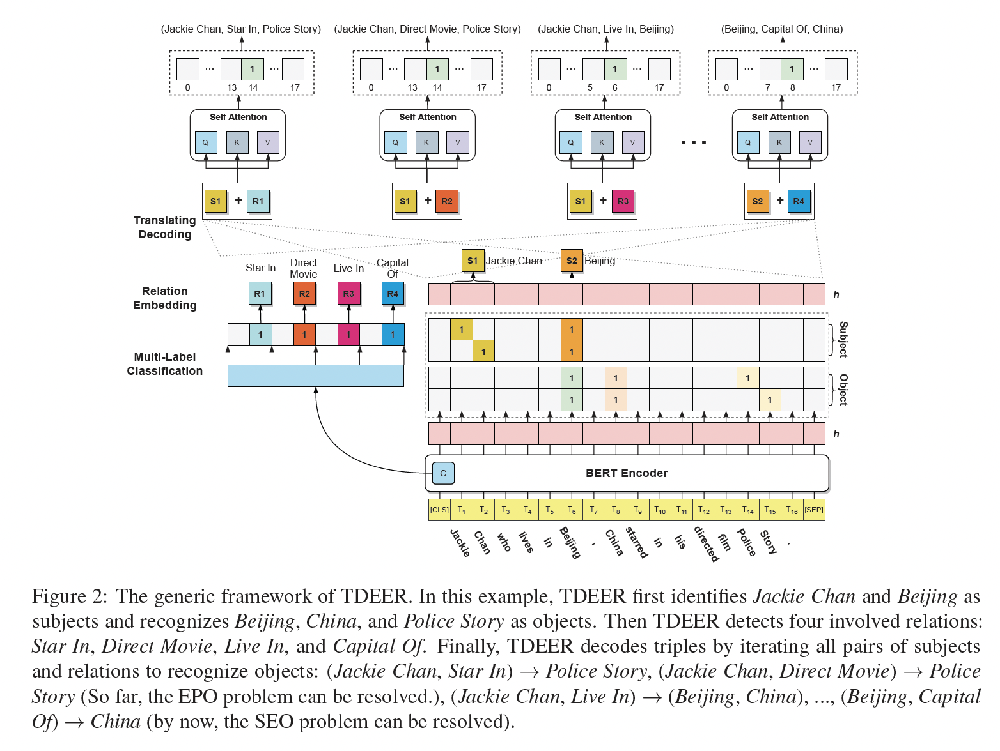
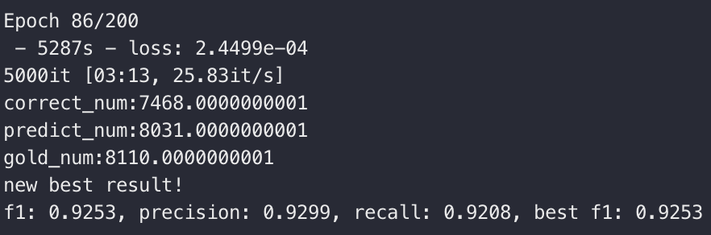
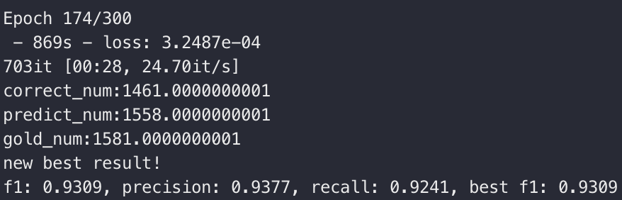
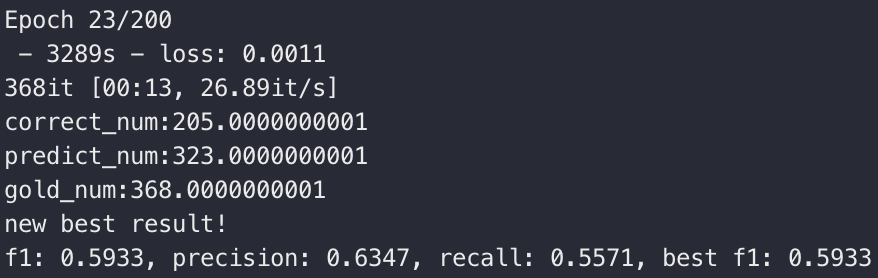

[](https://paperswithcode.com/sota/joint-entity-and-relation-extraction-on-nyt?p=tdeer-an-efficient-translating-decoding)
[](https://paperswithcode.com/sota/joint-entity-and-relation-extraction-on-1?p=tdeer-an-efficient-translating-decoding)
[](https://paperswithcode.com/sota/relation-extraction-on-nyt?p=tdeer-an-efficient-translating-decoding)
[](https://paperswithcode.com/sota/relation-extraction-on-webnlg?p=tdeer-an-efficient-translating-decoding)


**For the latest version, plz visit 👉 https://github.com/4AI/TDEER**


# TDEER (WIP)

Code For TDEER: An Efficient Translating Decoding Schema for Joint Extraction of Entities and Relations (EMNLP2021)

## Overview

TDEER is an efficient model for joint extraction of entities and relations. Unlike the common decoding approach that predicting the relation between subject and object, we adopt the proposed translating decoding schema: subject + relation -> objects, to decode triples. By the proposed translating decoding schema, TDEER can handle the overlapping triple problem effectively and efficiently. The following figure is an illustration of our models.



## Reproduction Steps

### 1. Environment


We conducted experiments under python3.7 and used GPUs device to accelerate computing. 

You can install the required dependencies by the following script.

```bash
pip install -r requirements.txt
```


### 2. Prepare Data

We follow [weizhepei/CasRel](https://github.com/weizhepei/CasRel) to prepare datas.

For convenience, you could download our preprocessed datasets ([Google Drive]() | [Baidu NetDisk]()).

Please place the downloaded data to `data` folder.


### 3. Download Pretrained BERT


Click 👉[BERT-Base-Cased](https://storage.googleapis.com/bert_models/2018_10_18/cased_L-12_H-768_A-12.zip) to download the pretrained model and then decompress to `pretrained-bert` folder.


### 4. Train & Eval

You can use `run.py` with `--do_train` to train the model. After training, you can also use `run.py` with `--do_test` to evaluate data.

Our training and evaluating commands are as follows:

1\. NYT

train:

```bash
CUDA_VISIBLE_DEVICES=0 nohup python -u run.py \
--do_train \
--model_name NYT \
--rel_path data/NYT/rel2id.json \
--train_path data/NYT/train_triples.json \
--dev_path data/NYT/test_triples.json \
--bert_dir pretrained-bert/cased_L-12_H-768_A-12 \
--save_path ckpts/nyt.model \
--learning_rate 0.00005 \
--neg_samples 2 \
--epoch 200 \
--verbose 2 > nyt.log &
```

evaluate:

```
CUDA_VISIBLE_DEVICES=0 python run.py \
--do_test \
--model_name NYT \
--rel_path data/NYT/rel2id.json \
--test_path data/NYT/test_triples.json \
--bert_dir pretrained-bert/cased_L-12_H-768_A-12 \
--ckpt_path ckpts/nyt.model \
--max_len 512 \
--verbose 1
```

You can evaluate other data by specifying `--test_path`.

2\. WebNLG

train:

```bash
CUDA_VISIBLE_DEVICES=0 nohup python -u run.py \
--do_train \
--model_name WebNLG \
--rel_path data/WebNLG/rel2id.json \
--train_path data/WebNLG/train_triples.json \
--dev_path data/WebNLG/test_triples.json \
--bert_dir pretrained-bert/cased_L-12_H-768_A-12 \
--save_path ckpts/webnlg.model \
--max_sample_triples 5 \
--neg_samples 5 \
--learning_rate 0.00005 \
--epoch 300 \
--verbose 2 > webnlg.log &
```

evaluate:

```bash
CUDA_VISIBLE_DEVICES=0 python run.py \
--do_test \
--model_name WebNLG \
--rel_path data/WebNLG/rel2id.json \
--test_path data/WebNLG/test_triples.json \
--bert_dir pretrained-bert/cased_L-12_H-768_A-12 \
--ckpt_path ckpts/webnlg.model \
--max_len 512 \
--verbose 1
```

You can evaluate other data by specifying `--test_path`.


3\. NYT11-HRL

train:

```bash
CUDA_VISIBLE_DEVICES=0 nohup python -u run.py \
--do_train \
--model_name NYT11-HRL \
--rel_path data/NYT11-HRL/rel2id.json \
--train_path data/NYT11-HRL/train_triples.json \
--dev_path data/NYT11-HRL/test_triples.json \
--bert_dir pretrained-bert/cased_L-12_H-768_A-12 \
--save_path ckpts/nyt11hrl.model \
--learning_rate 0.00005 \
--neg_samples 1 \
--epoch 100 \
--verbose 2 > nyt11hrl.log &
```

evaluate:

```
CUDA_VISIBLE_DEVICES=0 python run.py \
--do_test \
--model_name NYT11-HRL \
--rel_path data/NYT/rel2id.json \
--test_path data/NYT11-HRL/test_triples.json \
--bert_dir pretrained-bert/cased_L-12_H-768_A-12 \
--ckpt_path ckpts/nyt11hrl.model \
--max_len 512 \
--verbose 1
```


### Pre-trained Models

We release our pre-trained models for NYT, WebNLG, and NYT11-HRL datasets.

Click [Google Drive]() \| [Baidu NetDisk]() to download pre-trained models and then uncompress to `ckpts` folder.

To use the pre-trained models, you need to download our processed datasets and specify `--rel_path` to our processed `rel2id.json`.

To evaluate by the pre-trained models, you can use above commands and specify `--ckpt_path` to specific model.


In our setting, NYT, WebNLG, and NYT11-HRL achieve the best result on Epoch 86, 174, and 23 respectively.

1\. NYT



2\. WebNLG



3\. NYT11-HRL




## Citation

If you use our code in your research, please cite our work:


```bibtex
@inproceedings{li2021tdeer,
   title={TDEER: An Efficient Translating Decoding Schema for Joint Extraction of Entities and Relations},
   author={Li, Xianming and Luo, Xiaotian and Dong, Chenghao and Yang, Daichuan and Luan, Beidi and He, Zhen},
   booktitle={Proceedings of the 2021 Conference on Empirical Methods in Natural Language Processing (EMNLP)},
   year={2021}
}
```

## Contact

If you have any questions about the paper or code, you can

1) create an issue in this repo;
2) feel free to contact 1st author at niming.lxm@alipay.com / xmlee97@gmail.com, I will reply ASAP.
